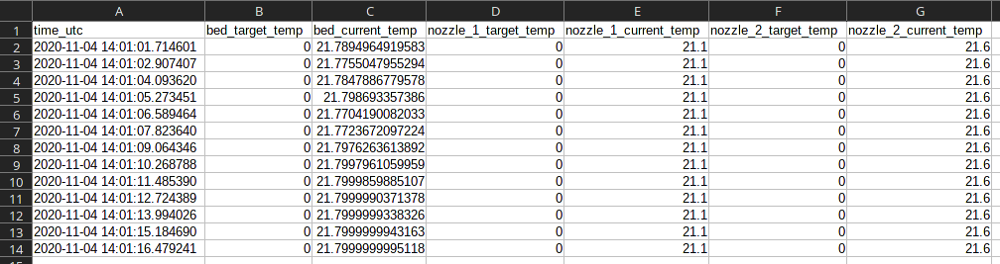

# Ulti-Logger

A useful python script that automaticaly logs the onboard sensors on your Ultimaker 3D printer during prints.

> **Note:** This is still a work-in-progress, suggestions and PR's are welcome!

## Data points

- [x] Local UTC time on printer (requires internet for NTP)
- [x] Target and current bed temperature
- [x] Target and current nozzle temperatures
- [x] XYZ position of the print head
- [ ] Flow sensor data (like filament used)
- [ ] Layer height

## Future features

- Option to select which data points to log
- Option to use system time instead of requesting time from printer
- Write code to add data points more easiliy

## Dependencies

- [Python](https://www.python.org/) >= 3.6
  - [JSON](https://docs.python.org/3/library/json.html)
  - [CSV](https://docs.python.org/3/library/csv.html)
  - [Time](https://docs.python.org/3/library/time.html)
  - [ArgParse](https://docs.python.org/3/library/argparse.html)
  - [DateTime](https://docs.python.org/3/library/datetime.html)
- [Requests](https://requests.readthedocs.io/en/master/)

## Using the script

> **Note:** Some people have said that [the WiFi connection drops out regularly](https://community.ultimaker.com/topic/29612-ultimaker-s5-disconnects-from-cura-connect-frequently/) during printing,
it is recommend to [connect using an Ethernet cable](https://support.ultimaker.com/hc/en-us/articles/360012609519-How-to-connect-your-printer-to-the-network) for best results.

1. [Download this repository](https://github.com/Teeffelen/ultimaker-s5-logger/archive/main.zip)
2. Open a terminal in the `src/` directory
3. Type `python ultilogger.py -h`, this will display the help page to get you started

Example of running the `ultilogger.py` script in the terminal:

```
$ python ultilogger.py -ip 192.168.10.102
+----------------------+
| Press CTRL+C to exit |
+----------------------+

- Using API address: http://192.168.10.102/api/v1
- Output directory: ./log/
- Connecting to API...
```

The script will automaticaly start logging once it connects to the API and a printjob starts printing.

Once the printjob is done, a CSV file will be created with the following format:

```
[Printer Name](start time of print) name of print.csv
```

This file can be opened in Microsoft Excel or LibreOffice Calc:



## REST API
The script uses the Ultimaker REST API, this API can be accessed over WiFi or directly using the Ethernet port.

More information about the REST API can be found locally on the printer itself:

- Connect the printer to your local network
- Get the local IP of the printer from the touchscreen interface
- Open a browser on a local PC and navigate to `http://<your printer IP>/docs/api/`
